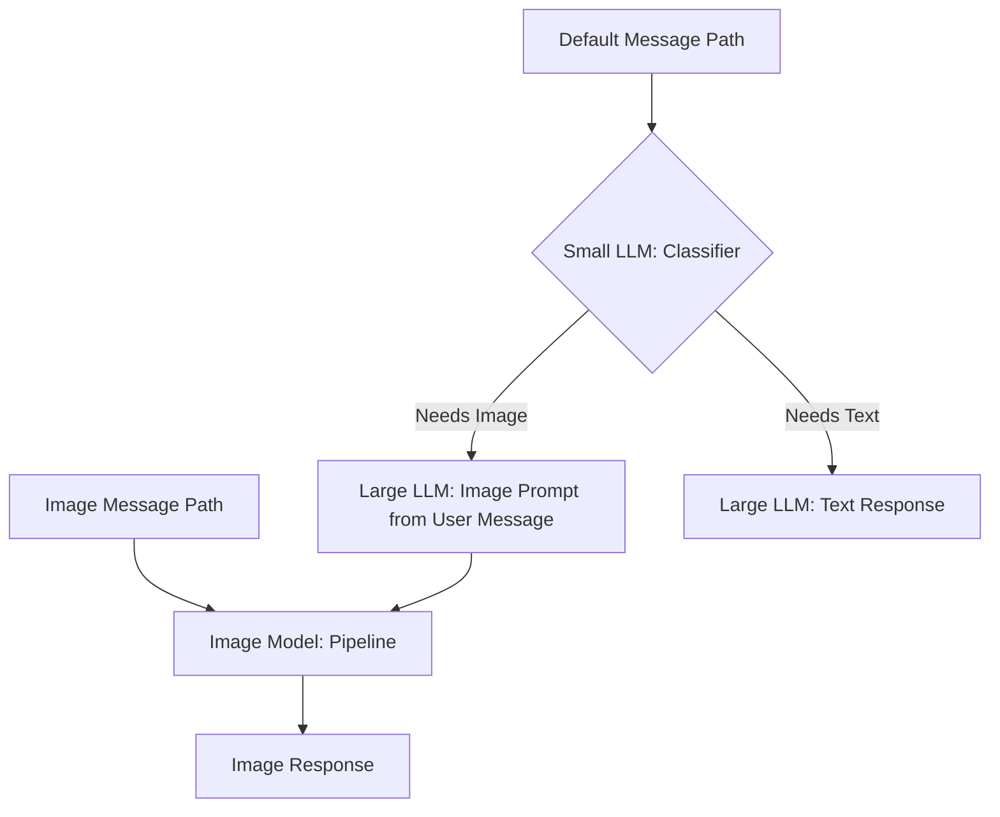

# AI for Web Devs 6: Mixture of Models

## First time setup

### Project

- `cp .env.example .env`

#### DB / SQLAlchemy

```sh
docker exec -it chat_web flask db init
docker exec -it chat_web flask db migrate -m "Initial migration"
docker exec -it chat_web flask db upgrade
docker exec -it chat_web flask db_seed

# One liner wipe and reset DB and migrations
docker exec -it chat_db psql -U app -c "DROP SCHEMA public CASCADE; CREATE SCHEMA public;"; rm -rf app/migrations; docker exec -it chat_web flask db init; docker exec -it chat_web flask db migrate -m "Initial migration"; docker exec -it chat_web flask db upgrade; docker exec -it chat_web flask db_seed
```

### Ollama

_https://ollama.com/library_

- `docker exec -it chat_ollama ollama run {MODEL NAME}`
- `docker exec -it chat_ollama ollama run tinydolphin`

### Svelte

- `cd components/chat`
- `npm i`

### Link build output to Flask static

- force the output to not include hash (vite config)
- add command to build and watch (package json)
- symlink component output from flask static dir
  - `cd app/static`
  - `mkdir components`
  - `cd components`
  - `ln -s ./../../components/chat/dist/assets ./chat`

## Start the stack

- `docker compose up --build`

### Fix perms issue

- `sudo chown -R $USER:$USER ./`

## MOM Diagram



## Resources

- [Mixture of Experts](https://huggingface.co/blog/moe)
- [Multimodal Models](https://huggingface.co/learn/computer-vision-course/en/unit4/multimodal-models/tasks-models-part1)
- [Chameleon Models](https://huggingface.co/facebook/chameleon-7b)
- [Chameleon Paper](https://arxiv.org/pdf/2405.09818)
- [Oasis (Minecraft) Model](https://oasis-model.github.io/)
- [Llama 3.2](https://ai.meta.com/blog/llama-3-2-connect-2024-vision-edge-mobile-devices/)
- [llama.cpp server docs (response format)](https://github.com/ggerganov/llama.cpp/blob/master/examples/server/README.md)
- [OpenAI Sturctured Outputs](https://openai.com/index/introducing-structured-outputs-in-the-api/)
